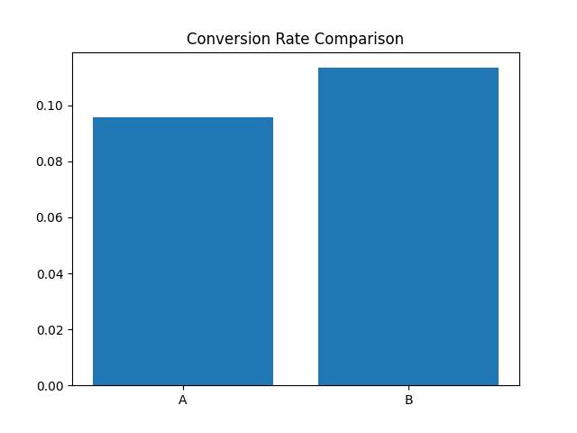

# A/B Testing & Conversion Optimisation

## Project Overview

This project evaluates the effectiveness of two website variants using A/B testing.

The objective is to determine whether a new product page design improves conversion rates and should be rolled out to all users.

---

## Business Problem

An e-commerce company launched a new landing page design.

Management wants to know:

- Does the new design increase conversions?
- Is the improvement statistically significant?
- Should the new version replace the existing page?

---

## Experiment Design

### Control Group (A)

Original Landing Page

### Treatment Group (B)

New Landing Page

### Sample Size

- Group A: 5,000 users
- Group B: 5,000 users

Total:

10,000 users

---

## Conversion Results

| Group | Users | Conversions | Conversion Rate |
|---------|---------|---------|---------|
| A | 5000 | 479 | 9.58% |
| B | 5000 | 567 | 11.34% |

---

## Uplift Analysis

Conversion Improvement:

18.37%

Formula:

(B - A) / A

Result:

11.34% - 9.58%

Relative Lift:

+18.37%

---

## Statistical Significance Test

Method:

Two-Proportion Z-Test

Results:

Z Statistic:

-2.88

P-Value:

0.0040

---

## Hypothesis Testing

### Null Hypothesis (H0)

There is no difference between Group A and Group B.

### Alternative Hypothesis (H1)

Group B performs better than Group A.

---

## Decision

Significance Level:

0.05

P-Value:

0.004

Since:

0.004 < 0.05

The result is statistically significant.

---

## Business Impact

The new page increased conversion rate by:

18.37%

This improvement is statistically significant and likely to generate additional revenue if deployed to all users.

---

## Recommendation

Deploy Version B.

Expected Benefits:

- Higher conversion rate
- Increased sales
- Improved customer acquisition efficiency

---

## Skills Demonstrated

- Python
- Pandas
- NumPy
- A/B Testing
- Experiment Design
- Hypothesis Testing
- Statistical Analysis
- Conversion Optimisation
- Product Analytics
- Business Decision Making

## Visualisation

