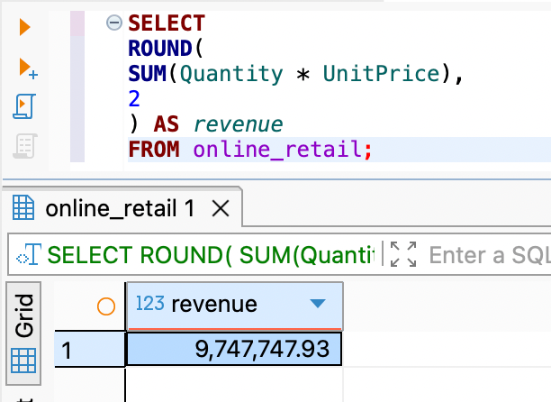
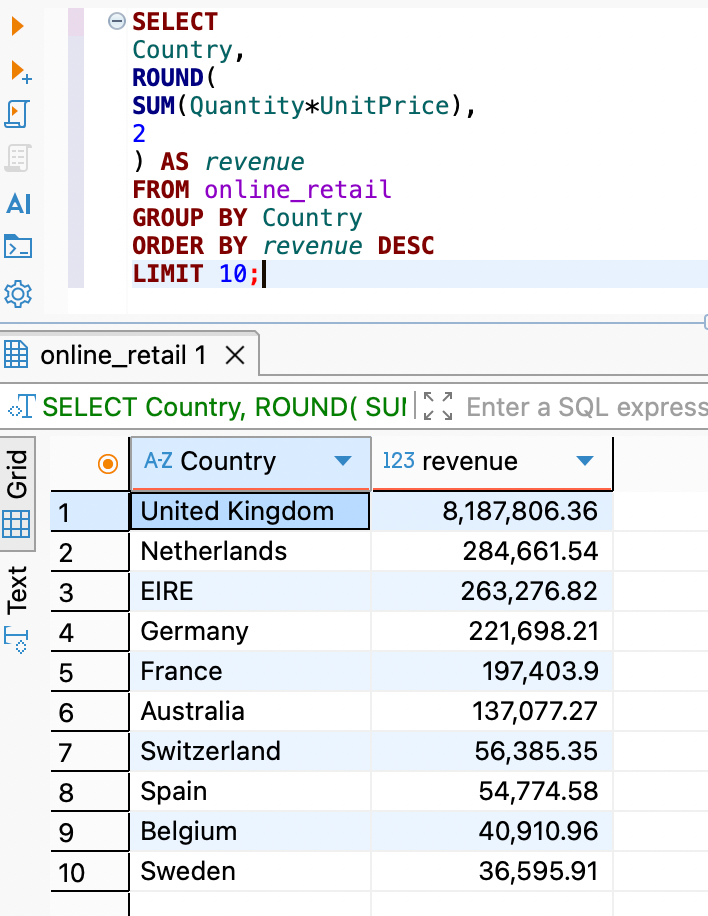
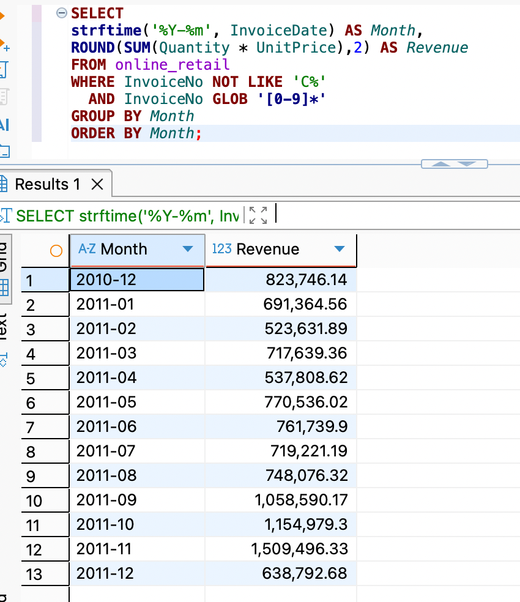
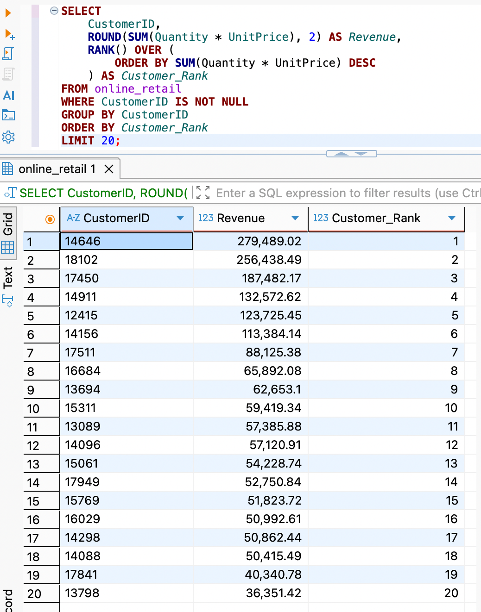

# SQL Business Analytics

## Project Overview

This project uses SQL to analyse an online retail dataset containing over 275,000 transactions.

The objective is to answer key business questions related to revenue performance, customer behaviour, product performance, and customer retention.

The analysis demonstrates practical SQL skills frequently required in Data Analyst and Business Intelligence roles.

---

## Business Questions

### Revenue Analysis

* What is total revenue?
* How does revenue change over time?
* Which countries generate the highest revenue?

### Customer Analysis

* How many unique customers exist?
* What is the repeat purchase rate?
* Who are the highest-value customers?

### Product Analysis

* Which products generate the most revenue?
* Which products sell the highest volume?

### Pareto Analysis

* Does 20% of customers generate 80% of revenue?

---

## Dataset

Online Retail Dataset

Transactions:
275,653

Customers:
4,372

Countries:
37

Period:
Dec 2010 – Dec 2011

---

## Key Findings

## SQL Analysis Results

| Metric | Result |
|----------|----------|
| Total Revenue | £9,747,747.93 |
| Total Orders | 22,061 |
| Unique Customers | 4,372 |
| Repeat Purchase Rate | 65.57% |
| Top Revenue Country | United Kingdom (£8.19M) |
| Top Revenue Product | DOTCOM POSTAGE (£206,248.77) |
| Top 20% Revenue Contribution | 74.6% |

### Total Revenue

£9.75M

### Total Orders

22,061

### Unique Customers

4,372

### Repeat Purchase Rate

65.57%

### Top Revenue Country

United Kingdom (£8.19M)

### Top Revenue Product

DOTCOM POSTAGE (£206,248.77)

### Pareto Analysis

Top 20% of customers generated 74.6% of total revenue.

### Revenue

Total Revenue:

£9.75M

### Orders

Total Orders:

22,061

### Customers

Unique Customers:

4,372

### Average Order Value

£441.85

### Repeat Purchase Rate

65.57%

### Top Revenue Country

United Kingdom

Revenue:

£8.19M

### Top Revenue Product

DOTCOM POSTAGE

Revenue:

£206,248.77

### Pareto Analysis

Top 20% of customers contributed approximately 74.6% of total revenue.

---

## SQL Techniques Used

* SELECT
* WHERE
* GROUP BY
* ORDER BY
* COUNT
* SUM
* AVG
* DISTINCT
* CTE
* Window Functions
* RANK()
* CASE WHEN

---

## Business Impact

The analysis identifies:

* Key revenue drivers
* High-value customer segments
* Revenue concentration risk
* Product opportunities
* Customer retention opportunities

These insights support commercial decision-making and business growth strategies.

## Business Insights

### Revenue Concentration

The United Kingdom generated over 80% of total revenue, indicating a strong dependence on a single market.

### Customer Loyalty

65.57% of customers made repeat purchases, suggesting relatively healthy customer retention.

### Pareto Effect

The top 20% of customers contributed 74.6% of revenue, highlighting the importance of high-value customer management.

### Seasonal Trend

Revenue peaked during September–November 2011, indicating strong seasonal purchasing behaviour before year-end holidays.

### Product Strategy

Revenue was concentrated among a limited number of products, suggesting opportunities for inventory optimisation and targeted promotions.

### Customer Retention

65.57% of customers made repeat purchases, indicating a relatively strong customer retention rate.

### Revenue Concentration

The United Kingdom contributed over 80% of total revenue, suggesting significant geographic concentration risk.

### Customer Value

The top 20% of customers generated 74.6% of revenue, confirming a strong Pareto effect.

### Product Strategy

Revenue is highly concentrated among a small number of products, highlighting opportunities for inventory optimisation and cross-selling.

---

## Screenshots

### Total Revenue

---

### Top Revenue Countries

---

### Monthly Revenue Trend

---

### Top Customers

