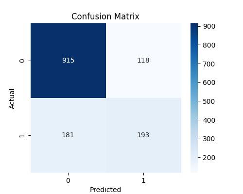
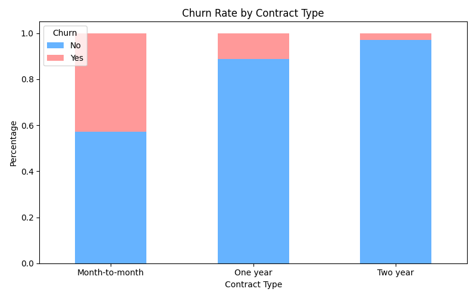
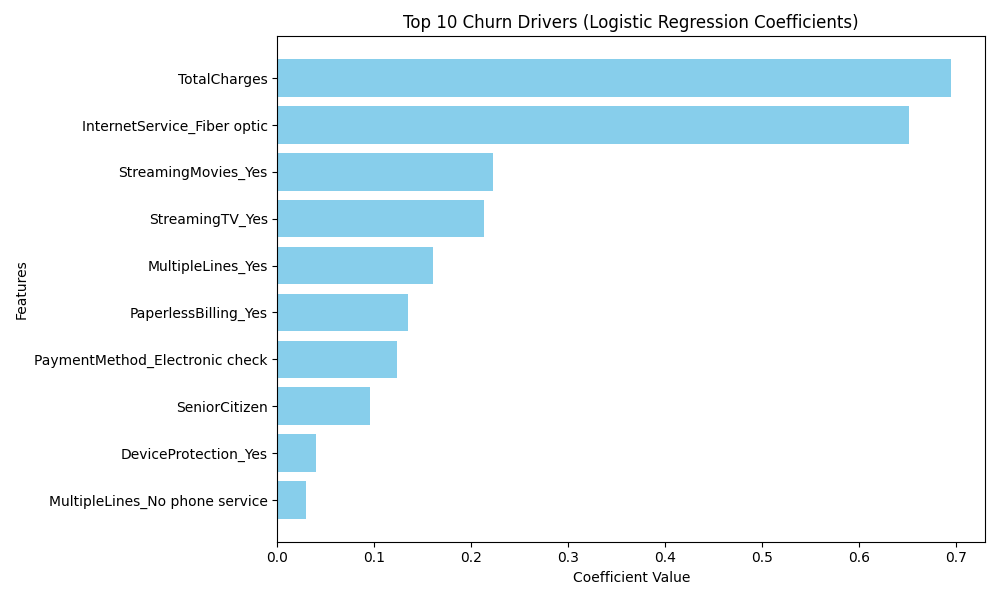

# Executive BI Dashboard

## Executive Summary

A Logistic Regression model was developed to predict customer churn using customer demographics, service subscriptions, contract information and payment behaviour.

The model achieved:

- 78.7% Accuracy
- 62% Precision
- 52% Recall

Analysis identified contract type, customer tenure and internet service usage as the strongest drivers of churn behaviour.

The findings provide actionable recommendations to improve customer retention and reduce revenue loss.

## Project Overview

This project develops a machine learning model to predict customer churn for a telecommunications company.

The objective is to identify customers at risk of leaving and uncover the key business drivers behind churn behaviour.

Using Logistic Regression, the model predicts customer churn and provides actionable retention insights.

---

## Business Problem

Customer acquisition is significantly more expensive than customer retention.

The business wants to:

- Predict customers likely to churn
- Understand churn drivers
- Improve customer retention
- Reduce revenue loss

---

## Dataset

Source:
Telco Customer Churn Dataset

Records:
7,043 customers

Target Variable:
Churn (Yes / No)

Features:

- Customer demographics
- Contract type
- Payment methods
- Internet services
- Monthly charges
- Tenure

---

## Technologies Used

- Python
- Pandas
- NumPy
- Scikit-Learn
- Matplotlib
- Seaborn
- Jupyter Notebook

---

## Data Cleaning

Steps performed:

- Removed customerID
- Converted TotalCharges to numeric
- Removed missing values
- Encoded target variable
- Applied One-Hot Encoding
- Standardised numerical features

---

## Machine Learning Model

Algorithm:

- Logistic Regression

Train-Test Split:

- 80% Training
- 20% Testing

Evaluation Metrics:

- Accuracy
- Precision
- Recall
- F1 Score

---

## Model Performance

| Metric | Score |
|----------|----------|
| Accuracy | 78.7% |
| Precision | 62% |
| Recall | 52% |
| F1 Score | 56% |

## Key Churn Drivers

### Higher Churn Risk

- High Total Charges
- Fiber Optic Internet Service
- Streaming Movies Subscription
- Streaming TV Subscription
- Multiple Phone Lines

### Lower Churn Risk

- Longer Customer Tenure
- One-Year Contract
- Two-Year Contract
- Online Security Service
- Technical Support Service

## Business Insights

## Business Impact

If the business focuses retention efforts on customers identified as high-risk, churn can potentially be reduced through:

- Contract upgrade campaigns
- Loyalty programmes
- Targeted retention offers
- Improved customer support services

The model enables data-driven retention strategies and supports proactive customer management.

### Contract Type Is The Strongest Retention Lever

Customers on month-to-month contracts exhibit a churn rate of 42.7%, compared with only 2.8% for customers on two-year contracts.

### Long-Term Customers Are More Loyal

Customers with longer tenure demonstrate substantially lower churn risk.

### Payment Behaviour Signals Churn Risk

Customers using electronic checks are significantly more likely to churn than customers using automatic payment methods.

### Fiber Optic Users Show Elevated Churn

Fiber optic internet customers have a higher probability of leaving, suggesting potential service quality or pricing concerns.

### Retention Opportunities

Encouraging customers to adopt longer contracts and value-added services such as Online Security and Tech Support could reduce churn.

## Screenshots

### Confusion Matrix

### Churn by Contract Type

### Feature Importance

## Future Improvements

Potential next steps include:

- Testing additional machine learning algorithms such as Random Forest and XGBoost
- Hyperparameter optimisation
- Feature engineering
- Probability-based customer risk scoring
- Deployment as an interactive dashboard
